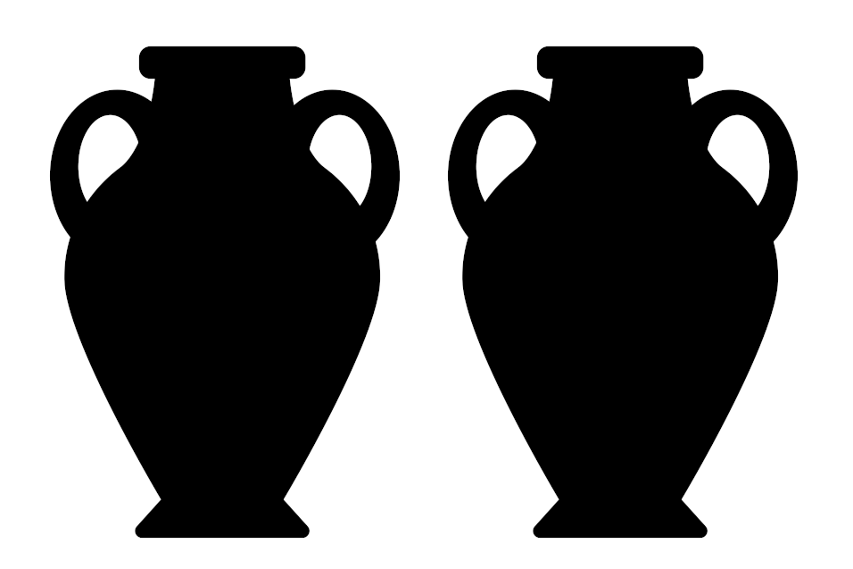
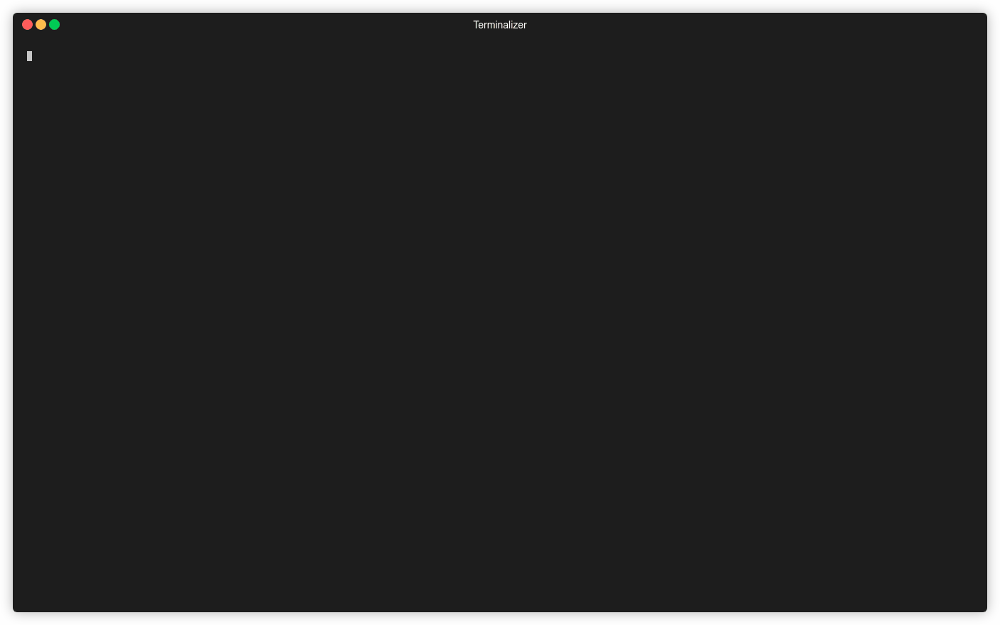

# Amfora


<h6>Image modified from: amphora by Alvaro Cabrera from the Noun Project</h6>


[](https://goreportcard.com/report/github.com/makeworld-the-better-one/amfora)
[](https://www.gnu.org/licenses/gpl-3.0.en.html)

<a href="https://raw.githubusercontent.com/makeworld-the-better-one/amfora/master/demo-large.gif">

</a>

###### Recording of v1.0.0

Amfora aims to be the best looking [Gemini](https://geminiquickst.art/) client with the most features... all in the terminal. It does not support Gopher or other non-Web protocols - check out [Bombadillo](http://bombadillo.colorfield.space/) for that.

It also aims to be completely cross platform, with full Windows support. If you're on Windows, I would not recommend using the default terminal software. Use [Windows Terminal](https://www.microsoft.com/en-us/p/windows-terminal/9n0dx20hk701) instead, and make sure it [works with UTF-8](https://akr.am/blog/posts/using-utf-8-in-the-windows-terminal). Note that some of the application colors might not display correctly on Windows, but all functionality will still work.

It fully passes Sean Conman's client torture test, as well as the Egsam one.

## Project Status

Amfora is in maintenance mode. When possible, I’ll make/merge bug fixes, and maybe slowly merge feature PRs by others. See my [blog post](https://www.makeworld.space/2023/08/bye_gemini.html) for details.

## Installation

### Binary

Download a binary from the [releases](https://github.com/makeworld-the-better-one/amfora/releases) page. On Unix-based systems you will have to make the file executable with `chmod +x <filename>`. You can rename the file to just `amfora` for easy access, and move it to `/usr/local/bin/`.

On Windows, make sure you click "Advanced > Run anyway" after double-clicking, or something like that.

Unix systems can install the desktop entry file to get Amfora to appear when they search for applications:
```bash
curl -sSL https://raw.githubusercontent.com/makeworld-the-better-one/amfora/master/amfora.desktop -o ~/.local/share/applications/amfora.desktop
update-desktop-database ~/.local/share/applications
```

Make sure to click "Watch" in the top right, then "Custom" > "Releases" to get notified about new releases!


### Linux

<a href="https://repology.org/project/amfora/versions">
    
</a>

Amfora is packaged in many Linux distros. It's also on [Scoop](https://scoop.sh/) for Windows users.

### macOS (Homebrew)

If you use [Homebrew](https://brew.sh/), you can install Amfora with:
```
brew install amfora
```
You can update it with:
```
brew upgrade amfora
```

### macOS (MacPorts)

On macOS, Amfora can also be installed through [MacPorts](https://www.macports.org):
```
sudo port install amfora
```
You can update it with:
```
sudo port selfupdate
sudo port upgrade amfora
```
**NOTE:** this installation source is community-maintained. More information [here](https://ports.macports.org/port/amfora/).

### Termux

If you're using [Termux](https://termux.com/) on Android you can't just run Amfora like normal. After installing Amfora, run `pkg install proot`. Then run `termux-chroot` before running the Amfora binary. You can exit out of the chroot after closing Amfora. See [here](https://stackoverflow.com/q/38959067/7361270) for why this is needed.

### From Source

This section is for advanced users who want to install the latest (possibly unstable) version of Amfora.

<details>
<summary>Click to expand</summary>

**Requirements:**
- Go 1.15 or later
- GNU Make

Please note the Makefile does not intend to support Windows, and so there may be issues.

```shell
git clone https://github.com/makeworld-the-better-one/amfora
cd amfora
# git checkout v1.2.3 # Optionally pin to a specific version instead of the latest commit
make # Might be gmake on macOS
sudo make install # If you want to install the binary for all users
```

Because you installed with the Makefile, running `amfora -v` will tell you exactly what commit the binary was built from.

Arch Linux users can also install the latest commit of Amfora from the AUR. It has the package name `amfora-git`, and is maintained by @lovetocode999

```
yay -S amfora-git
```

MacOS users can also use [Homebrew](https://brew.sh/) to install the latest commit of Amfora:

```
brew install --HEAD amfora
```
You can update it with:
```
brew upgrade --fetch-HEAD amfora
```

</details>


## Features / Roadmap
Features in *italics* are in the master branch, but not in the latest release.

- [x] URL browsing with TOFU and error handling
- [x] Tabbed browsing
- [x] Support ANSI color codes on pages, even for Windows
- [x] Styled page content (headings, links)
- [x] Basic forward/backward history, for each tab
- [x] Input (Status Code 10 & 11)
- [x] Multiple charset support (over 55)
- [x] Built-in search (uses geminispace.info by default)
- [x] Bookmarks
- [x] Download pages and arbitrary data
- [x] Theming
  - Check out the [user contributed themes](https://github.com/makeworld-the-better-one/amfora/tree/master/contrib/themes)!
- [x] Proxying
  - Schemes like Gopher or HTTP can be proxied through a Gemini server
- [x] Client certificate support
  - [ ] Full client certificate UX within the client
    - Create transient and permanent certs within the client, per domain
    - Manage and browse them
    - Similar to [Kristall](https://github.com/MasterQ32/kristall)
    - https://lists.orbitalfox.eu/archives/gemini/2020/001400.html
- [x] Subscriptions
  - Subscribing to RSS, Atom, and [JSON Feeds](https://jsonfeed.org/) are all supported
  - So is subscribing to a page, to know when it changes
- [x] Open non-text files in another application
  - [x] Ability to stream content instead of downloading it first
- [x] *Highlighting of preformatted code blocks that list a language in the alt text*
- [ ] Stream support
- [ ] Table of contents for pages
- [ ] Search in pages with <kbd>Ctrl-F</kbd>
- [ ] Persistent history


## Usage & Configuration
Please see [the wiki](https://github.com/makeworld-the-better-one/amfora/wiki) for an introduction on how to use Amfora and configure it.

## Libraries
Amfora ❤️ open source!

- [cview](https://code.rocketnine.space/tslocum/cview) for the TUI
  - It's a fork of [tview](https://github.com/rivo/tview) with PRs merged and active support
  - It uses [tcell](https://github.com/gdamore/tcell) for low level terminal operations
- [Viper](https://github.com/spf13/viper) for configuration and TOFU storing
- [go-gemini](https://github.com/makeworld-the-better-one/go-gemini), my forked and updated Gemini client/server library
- [progressbar](https://github.com/schollz/progressbar)
- [go-humanize](https://github.com/dustin/go-humanize)
- [gofeed](https://github.com/mmcdole/gofeed)
- [chroma](https://github.com/alecthomas/chroma) for source code syntax highlighting
- [clipboard](https://github.com/atotto/clipboard)
- [termenv](https://github.com/muesli/termenv)

## License
This project is licensed under the GPL v3.0. See the [LICENSE](./LICENSE) file for details.
